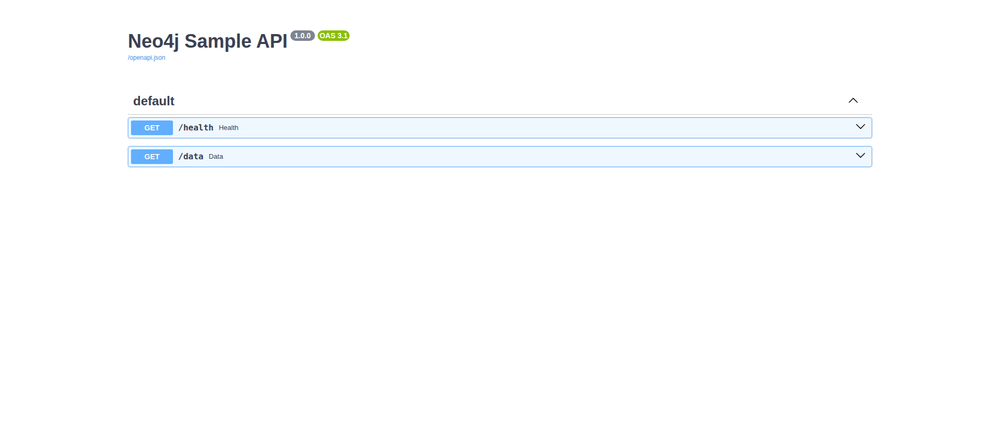
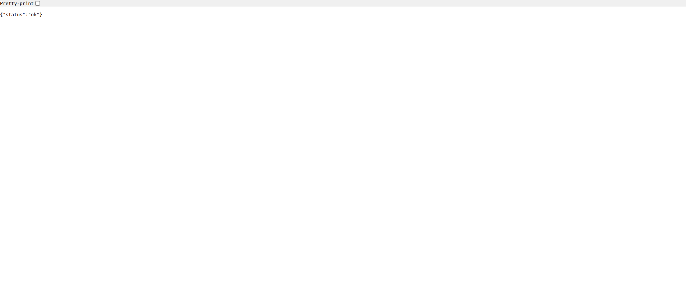
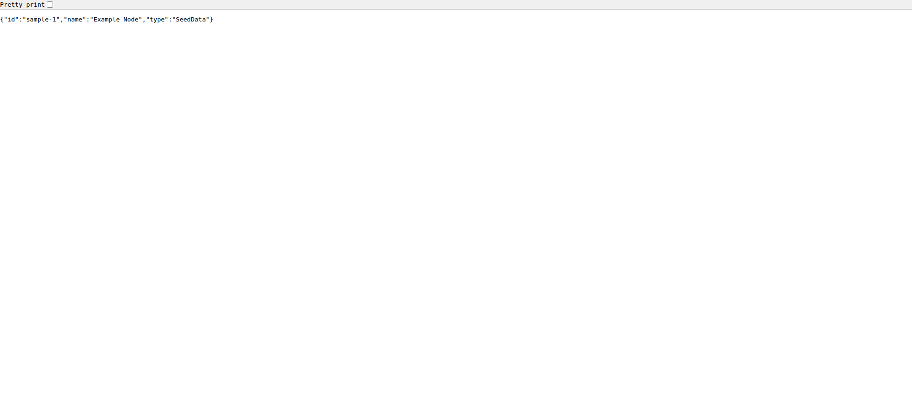
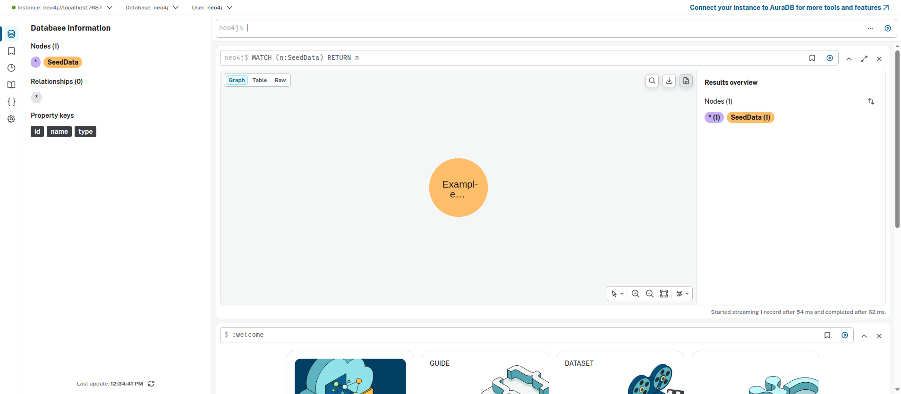
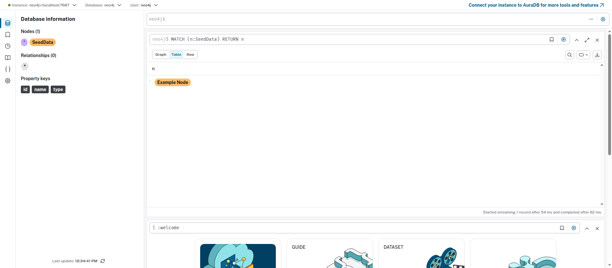

# neo4j-fastapi-azure

A minimal containerised **FastAPI** service backed by **Neo4j**, with **Terraform**-authored Azure
infrastructure and an **Azure DevOps** CI/CD pipeline.

The API exposes two endpoints:

| Method & path | Response |
| --- | --- |
| `GET /health` | `{"status":"ok"}` (liveness only — does not touch the database) |
| `GET /data` | The single seeded node: `{"id":"sample-1","name":"Example Node","type":"SeedData"}` |

### Chosen options

- **Neo4j — Option B + authored Azure path.** Neo4j runs locally in Docker Compose so `/data`
  works end-to-end and is verifiable. The Azure deployment path for Neo4j is *also* written in
  Terraform (as a Container App) but **authored, not applied**. Reason: there is no live Azure
  subscription in this setup — running locally proves the function, while the Terraform proves the
  deployment approach.
- **API host — Azure Container Apps (not AKS).** A single stateless container with one endpoint does
  not justify AKS. Container Apps needs far less infrastructure to be correct and complete, keeping
  the design simple rather than over-engineered. AKS would be the choice for multi-service
  orchestration, custom networking, or existing Kubernetes tooling.

---

## 1. Architecture overview

### Local (Docker Compose) — this is the part that actually runs

```
                     docker-compose network (expectai_default)
        ┌──────────────────────────────────────────────────────────────┐
        │                                                                │
 host   │   ┌───────────┐        bolt://neo4j:7687        ┌───────────┐  │
 :8000 ─┼─► │    api     │ ──────────────────────────────►│   neo4j   │  │
 /health│   │  FastAPI   │                                │   5.26    │  │
 /data  │   └───────────┘                                 └───────────┘  │
        │        ▲  depends_on: neo4j healthy + seeder done     ▲        │
        │        │                                              │ MERGE  │
        │   ┌───────────┐   one-shot, waits for healthy         │        │
        │   │  seeder    │ ─────────────────────────────────────┘        │
        │   └───────────┘   then exits (0)                               │
        └──────────────────────────────────────────────────────────────┘
```

Startup order is enforced by a Neo4j **healthcheck** plus `depends_on` conditions, so there is no
race: Neo4j becomes healthy → the seeder runs once and exits → the API starts.

### Azure (authored in Terraform, not applied)

```
   Internet ──HTTPS──► ┌──────────────────┐  pulls image  ┌──────────────────────┐
                       │ API Container App │◄──────────────│ Azure Container      │
                       │ (public ingress,  │               │ Registry (ACR)       │
                       │  port 8000)       │               └──────────────────────┘
                       └──────────────────┘
                                │ bolt:7687 (internal TCP ingress)
                                ▼
                       ┌──────────────────┐
                       │ Neo4j Container   │
                       │ App (internal)    │
                       └──────────────────┘

   Enclosing: Resource Group + Container Apps Environment + Log Analytics workspace
```

---

## 2. Azure services used and why

| Service | Role | Why |
| --- | --- | --- |
| **Resource Group** | Logical container for all resources | Standard unit for lifecycle + cleanup |
| **Azure Container Registry (ACR)** | Stores the API image | First-party registry; the pipeline pushes here and Container Apps pulls from it |
| **Container Apps Environment** | Shared runtime + network boundary | Hosts both container apps and gives them internal DNS to reach each other |
| **API Container App** | Runs the FastAPI container | Serverless containers, HTTPS ingress and scale-to-zero without managing a cluster |
| **Neo4j Container App** | The Azure deployment path for Neo4j | Same runtime as the API; internal-only TCP ingress on Bolt (7687) |
| **Log Analytics workspace** | Backs Container Apps logs/metrics | Central place for container logs and diagnostics |

**Why Container Apps over AKS:** one small stateless API does not need a Kubernetes control plane.
Container Apps delivers ingress, revisions, scaling and secrets with a fraction of the setup — the
simplest thing that is still production-shaped.

---

## 3. How to run the solution locally

Requires Docker Engine + the Compose plugin.

```bash
# 1. Provide a local Neo4j password
cp .env.example .env          # then edit NEO4J_PASSWORD in .env

# 2. Build and start the stack (Neo4j + one-shot seeder + API)
docker compose up --build

# 3. Verify (in another terminal)
curl localhost:8000/health    # -> {"status":"ok"}
curl localhost:8000/data      # -> {"id":"sample-1","name":"Example Node","type":"SeedData"}
```

Neo4j Browser is available at <http://localhost:7474> (log in with the credentials from `.env`).

Tear down:

```bash
docker compose down          # stop containers
docker compose down -v       # also remove the Neo4j data volume
```

---

## 4. How Neo4j is seeded

- `scripts/seed_neo4j.py` creates exactly one node — label `SeedData`, properties
  `id="sample-1"`, `name="Example Node"`, `type="SeedData"`.
- It uses **`MERGE`**, so it is **idempotent**: re-running never creates duplicates (verified — a
  second run still leaves exactly one `SeedData` node).
- It reads the same env vars as the API (`NEO4J_URI`, `NEO4J_USER`, `NEO4J_PASSWORD`) and retries
  briefly, so it is safe to start the moment Neo4j begins accepting connections.
- In Compose it runs as a **one-shot service** that waits for Neo4j's healthcheck, seeds, then exits;
  the API only starts once the seeder has completed successfully.

Run it manually against a running Neo4j if needed:

```bash
docker compose run --rm seeder
```

---

## 5. How to deploy infrastructure with Terraform

> **Status: authored and validated, NOT applied.** There is no live Azure subscription wired up in
> this setup, so the Terraform was written to be correct and reviewable rather than executed. It passes
> `terraform init`, `terraform fmt -check`, and `terraform validate` cleanly. `plan`/`apply` are
> intentionally left for an environment with real Azure credentials.

```bash
cd infra

# Provide values (terraform.tfvars is git-ignored)
cp terraform.tfvars.example terraform.tfvars   # edit values
export TF_VAR_neo4j_password='<a-strong-password>'   # keep the secret out of files

terraform init        # downloads the azurerm provider
terraform validate    # offline correctness check (passes today)
terraform plan        # requires Azure auth + a real subscription_id
terraform apply        # would create the resources (not run here)
```

Notes:
- The remote-state backend (`backend "azurerm"`) is present but **commented out** in
  `providers.tf` — local state is used here; production should use Azure Storage with
  locking (see §10).
- Before a real `apply`, the API image must exist in ACR (the pipeline in §6 pushes it), since the
  API Container App references `<acr-login-server>/<image>:<tag>`.
- Outputs include the public API URL/FQDN, the ACR login server, and the Neo4j internal FQDN.

---

## 6. How the Azure DevOps pipeline works

File: `pipelines/azure-pipelines.yml`. It triggers on push to `main` (paths under `app/`) and has two
stages:

1. **Build** — `Docker@2` builds `app/Dockerfile` and pushes to ACR via a Docker Registry service
   connection. The image is tagged with **`$(Build.BuildId)`** *and* `latest`, so any build is
   traceable and a bad rollout can be reverted by pinning a previous build id.
2. **Deploy** — an `AzureCLI@2` step runs `az containerapp update` (via an Azure Resource Manager
   service connection) to point the API Container App at the new image tag.

Prerequisites (documented in the file header, not hard-coded):
- A **GitHub service connection** so Azure DevOps can read this repo and trigger builds.
- Two service connections: `acr-service-connection` (Docker Registry → ACR) and
  `azure-service-connection` (ARM, Contributor on the resource group).
- A variable group **`neo4j-fastapi-vars`** with `acrLoginServer`, `imageRepository`,
  `resourceGroup`, `containerAppName` (sensitive values marked secret).

> **Status: authored, not executed** — there is no Azure DevOps organisation wired up here. The
> YAML is syntactically valid and references variables/service connections rather than literals.

---

## 7. Required environment variables and secrets

**Application / Compose** (the API and seeder read these from the environment; never hard-coded):

| Variable | Used by | Example (local) | Secret |
| --- | --- | --- | --- |
| `NEO4J_URI` | API, seeder | `bolt://neo4j:7687` | No |
| `NEO4J_USER` | API, seeder, Neo4j | `neo4j` | No |
| `NEO4J_PASSWORD` | API, seeder, Neo4j | *(your local password)* | **Yes** |

Local values live in `.env` (git-ignored); `.env.example` documents them.

**Terraform** (`infra/`):

| Variable | Purpose | Secret |
| --- | --- | --- |
| `subscription_id` | Target Azure subscription (plan/apply only) | No |
| `neo4j_password` | Neo4j password, wired into Container App **secrets** | **Yes** (`sensitive = true`, no default) |
| `location`, `prefix`, `resource_group_name`, `acr_name`, `api_image_name`, `image_tag`, `neo4j_user`, `neo4j_image` | Naming / parameters | No |

Real values go in `terraform.tfvars` (git-ignored); `terraform.tfvars.example` holds placeholders.

**Pipeline** (Azure DevOps variable group `neo4j-fastapi-vars`): `acrLoginServer`, `imageRepository`,
`resourceGroup`, `containerAppName` — secrets marked as secret variables; credentials come from
service connections, not the YAML.

---

## 8. What is complete

- ✅ FastAPI app with `/health` and `/data`, reading Neo4j config **only** from env vars.
- ✅ Dockerfile (slim base, non-root user, `EXPOSE 8000`).
- ✅ `docker compose up --build` brings up Neo4j + seeder + API; **verified end-to-end**:
  - `GET /health` → `{"status":"ok"}`
  - `GET /data` → `{"id":"sample-1","name":"Example Node","type":"SeedData"}` (sourced from Neo4j)
- ✅ Idempotent seeding via `MERGE` (verified: re-running keeps exactly one node).
- ✅ Terraform for the full Azure path — passes `init` / `fmt -check` / `validate`.
- ✅ Azure DevOps pipeline YAML — valid, parameterised, no hard-coded secrets.
- ✅ No secrets committed; `.env` and `*.tfvars` are git-ignored.

### Proof of local run (`screenshots/`)

FastAPI Swagger UI (`http://localhost:8000/docs`):



`GET /health` and `GET /data`:




Neo4j Browser — the single seeded `SeedData` node, reached over Bolt (graph + result table):




## 9. What is incomplete / not done (honest)

- ❌ **No live Azure deployment.** Terraform is authored + validated but never `apply`-ed (no
  subscription available in this setup). So there is no live API URL to submit.
- ❌ **Pipeline not executed** — no Azure DevOps organisation was used; it is reviewable, not run.
- ❌ **Neo4j on Azure not running** — its Container App is authored as the deployment path only.
- These are deliberate trade-offs: effort went into a verifiable local stack
  plus correct, reviewable infrastructure rather than a half-working live deploy.

## 10. What I would improve for production

- **Secrets:** move `NEO4J_PASSWORD` and ACR creds to **Azure Key Vault**, referenced by the
  Container Apps via managed identity instead of app secrets.
- **ACR auth:** pull images using a **managed identity** rather than the ACR admin user.
- **Terraform state:** enable the **remote `azurerm` backend** with state locking (Azure Storage).
- **Networking:** place the Container Apps Environment on a **VNet** and keep Neo4j strictly
  internal/private; restrict egress.
- **Data durability:** for real Neo4j, use **persistent storage + backups** (or Neo4j AuraDB) rather
  than an ephemeral container.
- **Scaling & resilience:** define **autoscaling** rules (KEDA/HTTP) and health probes on the API
  Container App.
- **Observability:** ship logs/metrics to **Log Analytics + Application Insights**, with alerts.
- **Rollback:** exploit Container Apps **revisions** and immutable image tags (already tagged by
  build id) for instant rollback.

---

## Repository structure

```
.
├── app/
│   ├── main.py                  # FastAPI: /health and /data
│   ├── requirements.txt         # fastapi, uvicorn, neo4j (5.x)
│   └── Dockerfile               # slim, non-root, EXPOSE 8000
├── infra/
│   ├── providers.tf             # azurerm + pinned versions; commented backend
│   ├── main.tf                  # RG, ACR, Container Apps env, API app, Neo4j app
│   ├── variables.tf             # typed inputs; secrets sensitive, no defaults
│   ├── outputs.tf               # API URL/FQDN, ACR login server, Neo4j FQDN
│   └── terraform.tfvars.example # placeholders only
├── pipelines/
│   └── azure-pipelines.yml      # build -> push to ACR -> deploy to Container Apps
├── scripts/
│   └── seed_neo4j.py            # idempotent MERGE of the single SeedData node
├── .env.example                 # NEO4J_URI/USER/PASSWORD placeholders
├── docker-compose.yml           # neo4j + one-shot seeder + api
└── README.md
```
